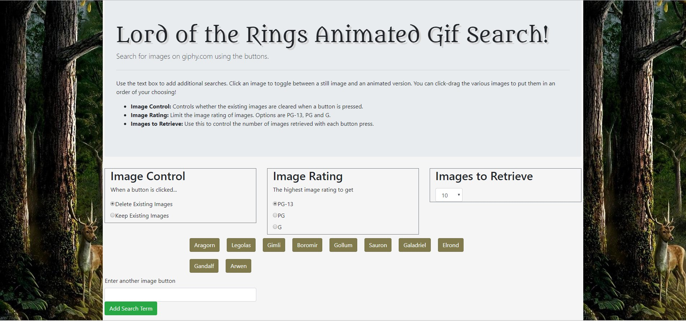
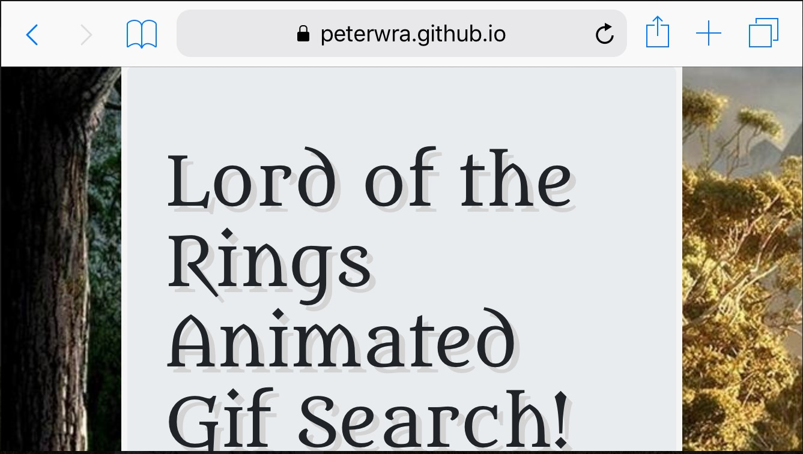
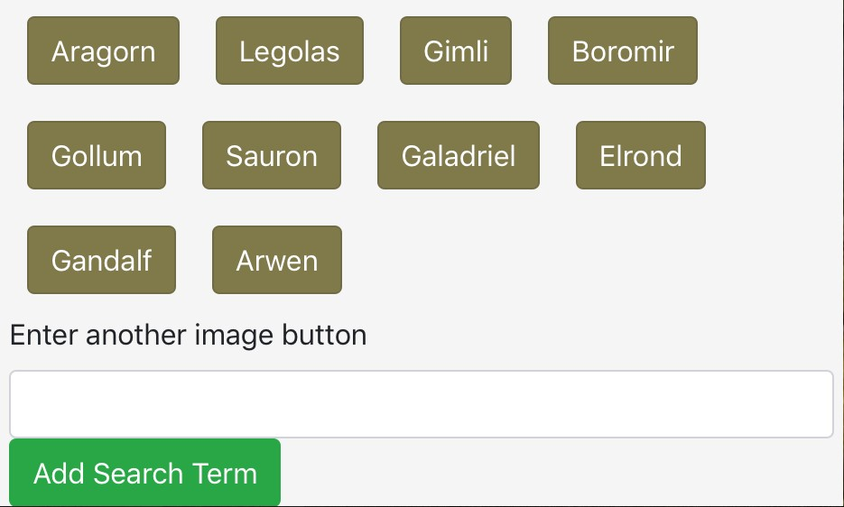
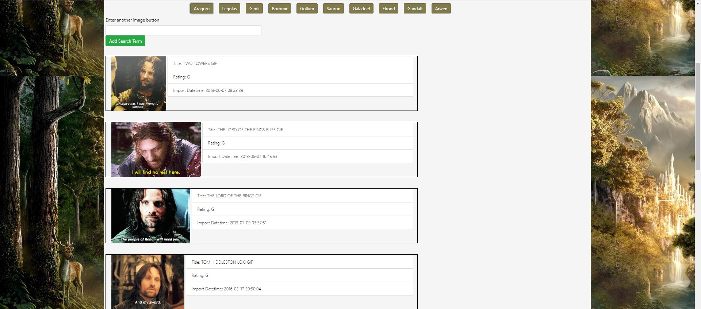
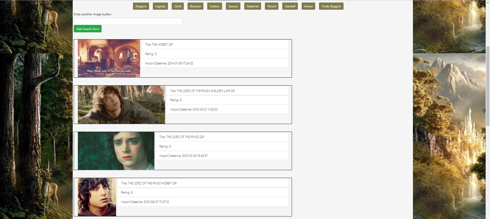
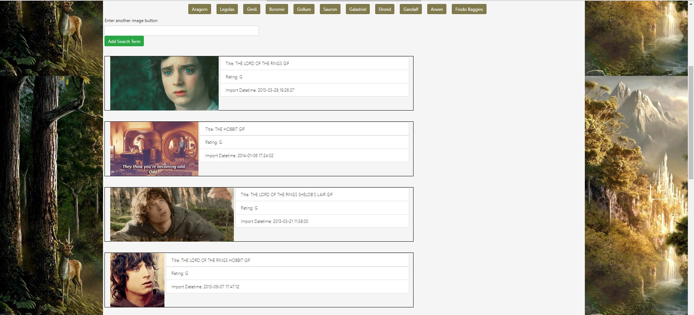

# GifTastic

## Overview

Lord of the Rings Animated Gif Search is a mini web search engine that is developed using Bootstrap, jQuery/UI, and Javascript to retrieve gifs related to Lord of the Rings characters from giphy.com. It allows user to search for gifs by clicking on any of the buttons that are already available on the webpage or add their own search item using the input box. It also allows user to control the display of the images by choosing to clear previous search results or add on to the existing images. Users can put a limitation on the number of images they wish to retrieve each time. Lastly, it also allows users to rearrange the order of the gifs displayed in the search result by dragging them around or play/pause a gif by clicking on it.

Technologies: jQuery, jQuery UI, Bootstrap, Javascript

## Deployed Link

https://peterwra.github.io/GifTastic/

## Views

This is the initial start page. The second and third images show how it appears on mobile.

Mobile 1 | Mobile 2
:-------------------------------------:|:-------------------------------------
 | 

Let's search for Aragorn by clicking on the brown 'Aragorn' button that was generated using jQuery. Then the user will see 10 images of Aragorn retrieved from giphy.com using their API.

If the user wishes to search for a character that is not there among the list of buttons, then enter the name of the character in the input box and add it as search item.

Then the new item is added to the end of the list of the buttons and the user can now search for gifs related to the new item in the same way as other buttons by clicking on it.

By using jQuery UI, it is possible for users to rearrange any image from the search result by dragging and dropping it in any order you would like them to display.

